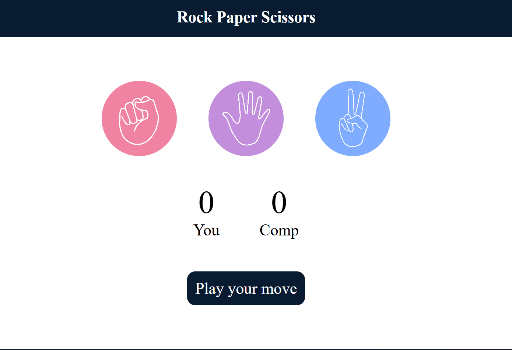

# 🎮 Rock Paper Scissors Game

A simple and interactive **Rock Paper Scissors** game built using **HTML, CSS, and JavaScript**.  
This project allows a user to play the classic Rock Paper Scissors game against the computer in the browser.

---

## 🌐 Live Demo
🔗 https://clinquant-brioche-223fb1.netlify.app

---

## 🚀 Technologies Used
- HTML
- CSS
- JavaScript

---

## ✨ Features
- User can choose **Rock, Paper, or Scissors**
- Computer generates a **random choice**
- **Automatic winner detection**
- **Instant result display**
- **Responsive design**

---

## 📸 Screenshot

---

## ▶️ How to Run the Project
1. Download or clone this repository  
2. Open the project folder  
3. Double-click on **index.html**  
4. The game will open in your browser  
5. Start playing!

---

## 📂 Project Structure

rock-paper-scissors/
│── index.html
│── style.css
│── script.js
│── rock.png
│── paper.png
│── scissors.png
│── README.md

---

## 🌟 Future Improvements
- Add **score tracking**
- Improve **UI design**
- Add **sound effects**
- Add **animations**

---

## 👩‍💻 Author
**Gayatri Deshmukh**  
Aspiring Web Developer 🚀
